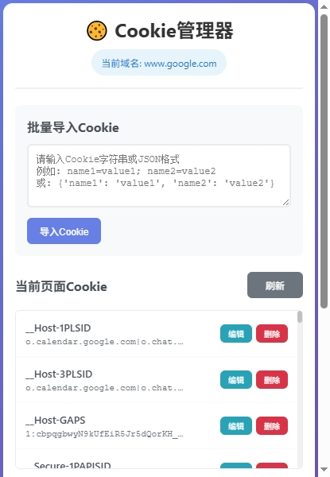

# CookieMake - Cookie管理器

🍪 一个功能强大的Chrome浏览器插件，用于管理、修改、删除当前页面的Cookie。

## ✨ 功能特性

- **可视化管理**: 以键值对形式直观显示当前页面的所有Cookie
- **便捷编辑**: 支持对Cookie进行增加、删除、修改操作
- **批量导入**: 支持Cookie字符串和JSON格式的批量导入
- **快速导出**: 一键导出当前页面所有Cookie为JSON格式
- **美观界面**: 现代化设计，操作简单直观
- **实时更新**: 修改后立即生效，无需刷新页面

## 🚀 安装方法

### 开发者模式安装

1. 打开Chrome浏览器
2. 进入扩展程序管理页面 (`chrome://extensions/`)
3. 开启右上角的"开发者模式"
4. 点击"加载已解压的扩展程序"
5. 选择本项目文件夹
6. 插件安装完成，在工具栏会出现Cookie管理器图标

## 📖 使用说明

### 基本功能

1. **查看Cookie**: 点击插件图标打开弹窗，自动显示当前页面的所有Cookie
2. **编辑Cookie**: 点击任意Cookie项右侧的"编辑"按钮进行修改
3. **删除Cookie**: 点击"删除"按钮移除指定Cookie
4. **添加Cookie**: 在底部输入框中输入名称和值，点击"添加"

### 批量操作

#### 导入Cookie

支持两种格式：

**Cookie字符串格式:**
```
name1=value1; name2=value2; name3=value3
```

**JSON格式:**
```json
{
  "name1": "value1",
  "name2": "value2",
  "name3": "value3"
}
```

#### 导出Cookie

点击"导出Cookie"按钮，所有Cookie将以JSON格式复制到剪贴板，方便保存和分享。

### 快捷操作

- **Enter键**: 在添加Cookie时，按Enter键可快速切换输入框
- **刷新**: 点击"刷新"按钮重新加载当前页面的Cookie
- **清除所有**: 一键清除当前域名下的所有Cookie

## 🛠️ 技术实现

### 权限说明

插件需要以下权限：
- `cookies`: 读取和修改Cookie
- `tabs`: 获取当前标签页信息
- `activeTab`: 访问当前活动标签页
- `storage`: 本地存储配置
- `host_permissions`: 访问所有网站的Cookie

### 技术栈

- **Manifest V3**: 使用最新的Chrome扩展API
- **Vanilla JavaScript**: 纯JavaScript实现，无外部依赖
- **CSS3**: 现代化响应式设计
- **Chrome Extensions API**: 使用Chrome原生扩展接口

### 项目结构

```
CookieMake/
├── manifest.json          # 插件配置文件
├── popup.html             # 弹窗页面
├── popup.css              # 样式文件
├── popup.js               # 核心功能脚本
├── icons/                 # 插件图标文件夹
└── README.md              # 项目说明文档
```

## 🔒 安全性

- 所有操作仅限于当前页面域名
- 不会收集或传输用户数据
- 完全本地运行，保护隐私安全
- 遵循Chrome扩展安全规范

## 🎯 使用场景

- **Web开发调试**: 快速修改测试Cookie值
- **会话管理**: 管理登录状态和用户偏好
- **数据分析**: 查看网站Cookie使用情况
- **隐私保护**: 清理不需要的跟踪Cookie
- **账号切换**: 快速切换不同账号的Cookie

## 📝 更新日志

### v1.0.0 (2025-07-10)
- ✅ 初始版本发布
- ✅ 基础Cookie增删改查功能
- ✅ 批量导入导出功能
- ✅ 美观的用户界面设计
- ✅ 完整的错误处理机制

## 🤝 贡献指南

欢迎提交Issue和Pull Request来改进这个项目！

### 开发环境搭建

1. 克隆项目到本地
2. 在Chrome中加载插件
3. 修改代码后刷新插件即可测试

### 代码规范

- 使用ES6+语法
- 添加详细的代码注释
- 遵循现有的代码风格
- 确保功能完整测试

## 效果图


## 📄 许可证

本项目采用 MIT 许可证，详情请参阅 [LICENSE](LICENSE) 文件。

## 🙏 致谢

感谢所有为这个项目做出贡献的开发者们！

---

**享受Cookie管理的便捷体验！** 🍪✨